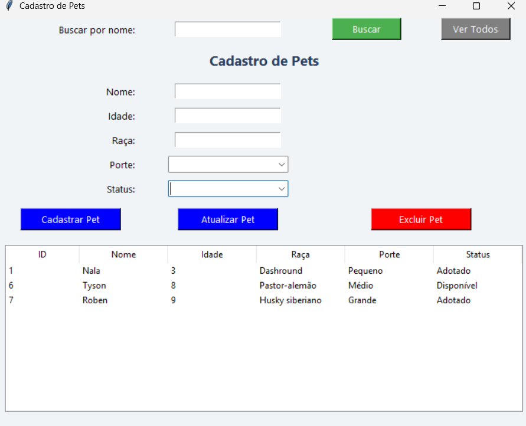

Cadastro de Pets - Tkinter + SQLite

Este projeto é uma aplicação desktop desenvolvida em **Python** com **Tkinter** e **SQLite**, feita para o cadastro e gerenciamento de pets.

- - -

Funcionalidades

- Cadastrar novos pets
- Atualizar informações
- Excluir pets cadastrados
- Buscar por nome (filtrar)
- Exibir todos os pets em tabela

- - -

Tecnologias Utilizadas

- Python
- Tkinter (interface gráfica)
- SQLite (banco de dados local)

- - -

Interface do sistema (Exemplo)

